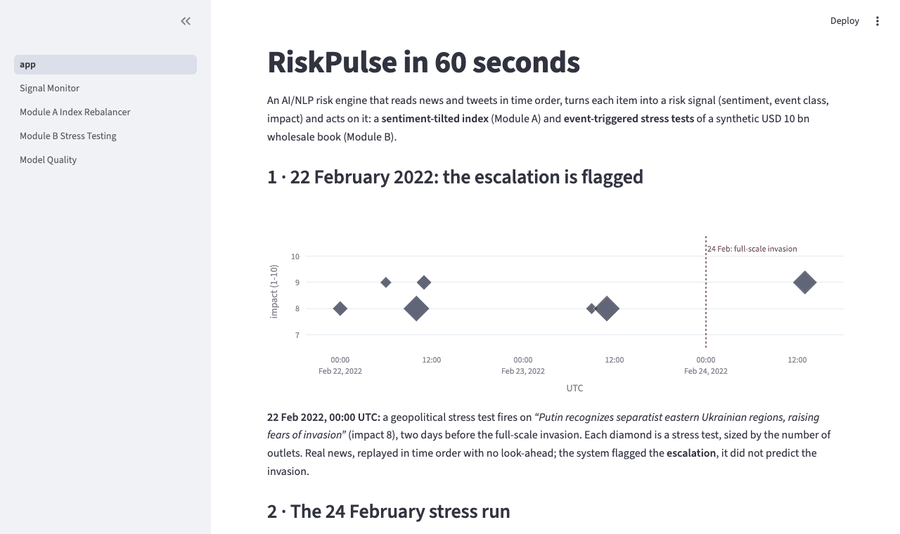
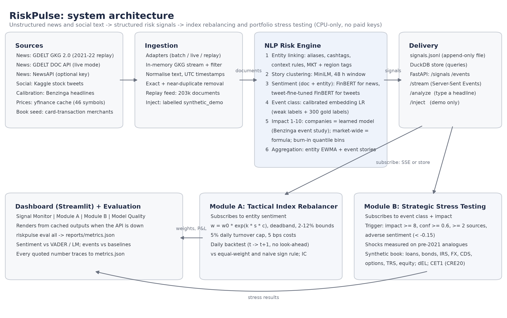

# RiskPulse: AI/NLP Risk Engine with Index Rebalancer and Stress Tester - S&P Global & Crisil Campus Hackathon
**Candidate Name:** Arnav Gupta
**College Email ID:** 23bds009@iiitdwd.ac.in
**College / Campus:** IIIT Dharwad
**Demo Video Link:** [YouTube unlisted link: to be added]
**Slide Deck Link (if hosted externally):** [`docs/presentation.pdf`](docs/presentation.pdf)
**Live demo (optional; may take ~1 min to wake):** https://riskpulseai.streamlit.app (dashboard on the committed snapshot; no live `/analyze`)

Built with AI-assisted coding tools; system design, data labelling and evaluation were reviewed and validated by the author.



<!-- GLANCE:START -->
### Results at a glance

| Result | Why you can trust it |
|---|---|
| **End to end on 203,363 real documents** (165,782 GDELT news, 37,581 tweets, 2021-09 → 2022-09); one command: `python -m riskpulse demo --fast`. | Real public data, replayed in time order; fresh-clone install tested. |
| **2022 Russia–Ukraine:** a geopolitical stress test fired at **2022-02-22 00:00 UTC**, two days before the 24 Feb invasion, on "Putin recognizes separatist eastern Ukrainian regions, raising fears of invasion"; the scenario got **9 of 14 factor directions right** over the 10 sessions from 24 Feb. | Out-of-sample: scenarios calibrated only on episodes before Sep 2021; the oil shock was underestimated. |
| **Module A, information coefficient +0.047, t-stat 2.85** (IC > 0 on 56.9% of 209 days). | Out-of-sample after a returns-free calibration of the tilt; returns are secondary (tilt -24.0% vs equal weight -23.3%). |
| **Impact v2 vs v1:** Spearman with abnormal returns 0.111 vs 0.055 (95% CI of the gain [0.0289, 0.0856]); on par with abs(sentiment) (0.110). | Trained on 2009-18 Benzinga, tested on 2021-22 (every look at that window logged, D-050); adoption rule revised after the first test (D-039). |
| **Sentiment on live news (FinBERT):** macro-F1 0.592 vs VADER 0.471 and Loughran-McDonald 0.442 (n 237). | Human-labelled, pre-registered; these labels also helped choose FinBERT for news, so slightly optimistic. |
| **Entity linking precision 82.0%** (95% CI 73.3%–88.3%). | Human-checked: 100 random headline links. |
| **Pipeline:** 86.6 documents/s batch; 21.3 ms p95 per document. | Measured on a 10-core laptop CPU, no GPU, with both sentiment models loaded. |

Not everything worked; see [Limitations](#limitations-measured-not-assumed): event classification is no better than a keyword baseline, market-wide impact does not predict SPY or VIX moves, stress-trigger timing is no better than random against market stress days (it fires on most sessions), and the June 2022 FOMC hike was missed (no adverse trigger on the day; the reaction was a relief rally that the scenarios, lacking a surprise-vs-consensus measure, can't represent).
<!-- GLANCE:END -->

## 1. Project Overview / Problem Statement & Approach

Risk desks read thousands of headlines and posts a day, but positioning and stress testing need *structured* inputs.
RiskPulse is a CPU-only platform that ingests unstructured text from two kinds of sources (news from the GDELT
Global Knowledge Graph and social posts from a stock-tweet corpus), and turns each item into a versioned risk signal
with a **sentiment score** (−1 to 1, FinBERT for news and a tweet-fine-tuned FinBERT for tweets, at document *and* entity level), an **event class** (ten classes
including the five in the brief), and an **impact score** (1 to 10) whose drivers are explained ("why 8/10").
Signals are written to an append-only JSONL file and served by a FastAPI service with a Server-Sent Events stream
that downstream modules subscribe to.

Both downstream modules are implemented. **Module A** maintains a mock index of 20 S&P 100 stocks whose weights tilt
with decayed entity sentiment, `w = w0 · exp(κ · s · c)`, inside weight bounds and a 5% daily turnover cap, and is backtested
daily without look-ahead against an equal-weight index and a naive sign rule. **Module B** holds a synthetic
wholesale-banking book (loans, bonds, interest-rate swaps, FX forwards, equity options and total-return swaps, CDS and
equity) seeded from card-transaction merchant data. When a high-impact adverse event arrives (impact ≥ 8, confident
class, ≥ 2 independent sources, negative sentiment) it applies risk-factor shocks *measured* over historical analogue episodes, then reports
portfolio value before and after, P&L by asset class, sector, rating and region, the change in expected loss, and a
CET1 ratio using Basel CRE20 risk weights.

The design choices are aimed at honesty: every evaluation uses held-out data and naive baselines (no FinBERT score on
the PhraseBank data it was trained on), the impact thresholds are fitted on a burn-in period, scenario shocks are
calibrated only on episodes that end *before* the replay window (so 2022 events serve as out-of-sample checks), and
every number in this README is produced by a script and stored in `reports/metrics.json`.

## 2. Architecture & Tech Stack



| Layer | What it does | Tech |
|---|---|---|
| Ingestion | GDELT GKG 2.0 15-minute files streamed and filtered in memory (2021-09 → 2022-09), stock tweets, GDELT DOC API (live), optional NewsAPI; normalisation; exact and near-duplicate removal; replay feed | requests, pandas, rapidfuzz |
| Entity linking | aliases, cashtags, brands and executives with context rules for ambiguous names; market-wide `MKT` entity with region tags | regex rules, spaCy (available) |
| Sentiment | FinBERT for news; FinBERT fine-tuned on the tweet train split for tweets (weights on the Hugging Face Hub, local rebuild or base FinBERT as fallbacks); document and clause-level entity sentiment; VADER and Loughran-McDonald baselines | transformers, torch (CPU) |
| Event classification | calibrated logistic regression on MiniLM embeddings trained on weak labels; keyword and zero-shot NLI baselines | sentence-transformers, scikit-learn |
| Impact | company mentions: v2, monotone gradient boosting learned on a Benzinga event study (2009-2018) and scored from a JSON tree dump; market-wide items: v1, class prior × (sentiment, velocity, breadth, novelty, credibility) × relevance; burn-in quantile mapping to 1-10 per population | LightGBM (training only), numpy |
| Story clustering | online cosine clustering in a 48 h window, novelty over 72 h | sentence-transformers |
| Delivery | JSONL + DuckDB store; REST, SSE stream, `/analyze`, `/inject` | FastAPI, sse-starlette, DuckDB |
| Module A | sentiment tilt, capped weights, turnover cap, costs; daily backtest; IC; robustness grid | numpy, scipy |
| Module B | synthetic book generator, analogue-calibrated scenarios, duration/convexity, DV01, spread DV01, greeks, ΔEL, CET1 | numpy, scipy |
| Dashboard | Signal Monitor, Module A, Module B, Model Quality (light, consulting style) | Streamlit, Plotly |
| Quality | unit tests for formulas, signs, look-ahead and parsers | pytest, ruff |

## 3. Dataset Used

All data is public or synthetic; no proprietary or client data. Full details, licences and verification notes are in
[`data/SOURCES.md`](data/SOURCES.md); modelling assumptions are in [`docs/ASSUMPTIONS.md`](docs/ASSUMPTIONS.md).

- **News:** GDELT GKG 2.0 (6,680 sampled 15-minute files, one per hour on weekdays and every 6 h at weekends,
  2021-09-30 → 2022-09-29), filtered to headlines naming the 20 companies or carrying macro, geopolitical or credit
  themes. Raw files are never stored; the filtered, deduplicated replay feed is committed
  (`data/replay/feed.jsonl.gz`, 203,363 documents including social).
- **Social:** Kaggle "Stock Tweets for Sentiment Analysis and Prediction" (CC0, 2021-09-30 → 2022-09-29). Cashtag
  lists and tweets that never mention their company are dropped. The PG and MSFT sets in this dataset are copies of
  the AMZN set; the filter removes them.
- **Labelled evaluation:** Twitter Financial News sentiment and topic datasets (Hugging Face, MIT).
- **Impact calibration (event study):** Benzinga headlines with tickers (Kaggle, CC0, 2009-2020).
- **Prices:** yfinance daily history for the universe and risk-factor proxies, cached in `data/prices/`.
- **Module B seed:** Kaggle "Financial Transactions Dataset" (Apache 2.0), merchant fields only, aggregated to
  synthetic obligors `CP_0001…`. Credit inputs: S&P long-run one-year default rates by rating (2024 study, Table 24)
  and spread levels anchored to Moody's Baa minus the 10-year Treasury (FRED) and scaled by ICE BofA OAS ratios.
- **Human gold set:** 300 stratified items labelled by the author (`data/gold/`), used only for testing.
- **Synthetic content:** the Module B book and any headline injected in the demo are labelled `synthetic_demo`.

Key assumptions: universe of 20 current S&P 100 names chosen for overlap with the tweet data (tech-heavy by
construction); 1/4 sampling of GDELT (velocity is relative, not absolute); starting CET1 ratio 13% and credit-risk RWA
only; ratings held fixed under stress.

## 4. Quickstart & Installation

Runtime: **Python 3.11** on **macOS 27.0 (Apple silicon, arm64)**; CPU only; no API keys needed.

```bash
git clone https://github.com/arnavgupta2004/iiit-dharwad-arnav-gupta-hackathon.git
cd iiit-dharwad-arnav-gupta-hackathon
python3.11 -m venv .venv && source .venv/bin/activate
pip install -r requirements.txt
```

```bash
python -m riskpulse demo --fast      # dashboard from precomputed outputs, no model downloads
```

Open http://localhost:8501 (dashboard) and http://127.0.0.1:8000/docs (API).

```bash
python -m riskpulse demo             # loads models; replays Feb-Mar 2022 live through the engine
python -m riskpulse demo --live      # current GDELT news (news only), labelled "live, unvalidated" (D-065)
python -m riskpulse eval all         # regenerates every metric in reports/
pytest -q                            # tests
```

**First live run downloads models.** `demo`, `serve --full` (and so the first `/analyze` call) need the fine-tuned
sentiment model, which is fetched from the Hugging Face Hub ([`arnavguptas/riskpulse-finbert-tweets`](https://huggingface.co/arnavguptas/riskpulse-finbert-tweets)),
plus a small sentence-embedding model. That's about 500 MB once, into the Hugging Face cache. Measured from a fresh
clone with an empty cache: about 100 s to download and load the sentiment model, and the API ready about 45 s
later. Models load at server start, so `/analyze` then answers in about 0.1 s. If the Hub is unreachable, the engine
uses a locally rebuilt copy (`python scripts/build_finetuned_sentiment.py`, about 25 CPU minutes) or falls back to base
FinBERT, and logs which one it used. Trained classifier and impact-v2 files are not in the repo: without them the
engine logs a warning and uses the keyword event baseline and impact v1. `demo --fast` needs none of this.

Rebuilding everything from raw sources (optional, about 2-3 hours, mostly downloads and model inference):

```bash
python scripts/download_kaggle.py && python scripts/download_hf.py && python scripts/download_prices.py
python -m riskpulse ingest --source gdelt_gkg      # streams GDELT files; stores only filtered rows
python -m riskpulse ingest --source feed           # builds the replay feed
python -m riskpulse train events                   # trains the event classifier
python -m riskpulse train impact_v2                # Benzinga event study -> impact v2 (scores headlines first)
python -m riskpulse process                        # engine over the feed -> signals
python -m riskpulse backtest                       # Module A
python -m riskpulse stress --build-portfolio --replay   # Module B
```

## 5. Key Results & Domain Impact

All figures below are generated from `reports/metrics.json` by `scripts/render_readme_results.py`.

<!-- RESULTS:START -->
**Sentiment** (held-out Twitter Financial News, n = 2,388; bands tuned on train only)

| Method | Macro-F1 | Accuracy |
|---|---|---|
| FinBERT (train-tuned band) | 0.661 | 0.739 |
| FinBERT (argmax) | 0.668 | 0.725 |
| Loughran-McDonald lexicon | 0.460 | 0.601 |
| VADER | 0.448 | 0.534 |
| Majority class (neutral) | 0.264 | 0.656 |

**Sentiment models in use: FinBERT for news, FinBERT fine-tuned on the tweet train split for tweets** (D-058). The fine-tuned model scores 0.844 in-domain (same dataset as its training data). On live-feed text (Arnav's gold-1 labels, rule pre-registered before scoring, D-041):

| Live-feed gold | n | FinBERT | Fine-tuned | Fine-tuned − FinBERT (95% CI) | VADER | LM |
|---|---|---|---|---|---|---|
| News headlines | 237 | 0.592 | 0.549 | -0.043 [-0.1146, 0.0321] | 0.471 | 0.442 |
| Tweets | 63 | 0.389 | 0.368 | -0.021 [-0.1087, 0.0705] | 0.297 | 0.257 |

The in-domain gain does not transfer to news.

Pooled news check (gold-1 + gold-2 news, n = 397, rule pre-registered in D-057): fine-tuned 0.488 vs FinBERT 0.576, difference -0.088, 95% CI [-0.1455, -0.0299] (entirely below 0), so news switched to FinBERT. This was a post-hoc revision prompted by the gold-2 evidence (D-058).

**Event classification: final test on gold-2** (n = 200, Arnav's labels, evaluated once; model fixed before the labels were read, D-052/D-053). Macro-F1 over 10 classes:

| Method | All (n 200) | News (n 160) | Tweets (n 40) | C1 − method, 95% CI (all) |
|---|---|---|---|---|
| **Deployed: C1** (weak labels + gold-1) | 0.559 | 0.610 | 0.197 | - |
| Previous model (weak labels only) | 0.577 | 0.625 | 0.207 | [-0.0801, 0.032] |
| Keyword baseline | 0.595 | 0.660 | 0.216 | [-0.1261, 0.0487] |
| Zero-shot NLI (base) | 0.578 | 0.662 | 0.035 | [-0.0804, 0.0983] |
| Zero-shot NLI (large, reference; too slow for the feed on CPU) | 0.513 | 0.568 | 0.079 | [-0.0566, 0.1374] |

Selection by cross-validation on gold-1 (15 folds): C1 0.600, C2 0.606, C3 0.605; the one-SE rule chose C1 (D-053). GEOPOLITICAL is cross-border only (D-044).

In-domain reference sets (not the final test):

| Evaluation set | Method | n | Macro-F1 |
|---|---|---|---|
| in-domain (HF topic data) | keyword_baseline | 2,900 | 0.538 |
| in-domain (HF topic data) | primary_embed_lr | 2,900 | 0.713 |
| weak-label hold-out (circular) | keyword_baseline | 1,893 | 0.947 |
| weak-label hold-out (circular) | primary_embed_lr | 1,893 | 0.750 |
| in-domain (HF topic data, subsample) | zero_shot | 516 | 0.697 |
| in-domain (HF topic data, subsample) | keyword_baseline | 516 | 0.576 |
| in-domain (HF topic data, subsample) | primary_embed_lr | 516 | 0.808 |

**Entity linking:** precision 82.0% on 100 hand-checked headline links (95% Wilson CI 73.3%–88.3%).

**Module A, headline: information coefficient** (evaluation 2021-11-30 to 2022-09-29): mean daily IC +0.0472, t-stat 2.85, IC > 0 on 56.9% of 209 days (daily Spearman of decayed sentiment vs next-day return).

Tilt strength κ = 7.69, frozen by a risk budget (median absolute active weight 1.5%) computed from signals only over 2021-09-30 to 2021-11-29; returns were never used to set it.

Returns (secondary; net of 5 bps costs; a sentiment-tilt demonstration, not an alpha claim):

| Strategy | Gross return | Cost drag | Net return | Sharpe (rf = 0) | Max drawdown | Avg daily turnover |
|---|---|---|---|---|---|---|
| sentiment tilt | -23.6% | 0.52% | -24.0% | -1.074 | -27.9% | 5.00% |
| equal weight buy hold | -21.5% | 0.00% | -21.5% | -1.083 | -25.2% | 0.00% |
| equal weight rebalanced | -23.2% | 0.07% | -23.3% | -1.044 | -27.0% | 0.67% |
| naive sign rule | -20.9% | 2.10% | -22.6% | -0.976 | -26.7% | 20.10% |

Turnover cap 5% one-way per day, set by policy for operational realism (D-045), not optimised on returns.

**Module B** (replay 2021-09 to 2022-09): 3,382 high-impact candidates, 403 triggers fired (17 escalations), 345 stress runs. Cooldown: 24 h per event class and macro-region, re-run within it only on higher impact. Stress runs per month: 2021-09 1, 2021-10 34, 2021-11 21, 2021-12 19, 2022-01 25, 2022-02 27, 2022-03 36, 2022-04 38, 2022-05 32, 2022-06 24, 2022-07 31, 2022-08 32, 2022-09 25. First runs:

| Trigger time (UTC) | Scenario | Impact | Sources | Total impact | CET1 after |
|---|---|---|---|---|---|
| 2021-09-30T03:00 | GEOPOLITICAL:default | 8 | 2 | -0.10% | 12.98% |
| 2021-10-01T08:00 | GEOPOLITICAL:default | 9 | 2 | -0.13% | 12.98% |
| 2021-10-04T14:00 | GEOPOLITICAL:default | 8 | 4 | -0.10% | 12.98% |
| 2021-10-04T17:00 | OPERATIONAL_ESG:default | 8 | 2 | -3.77% | 9.50% |
| 2021-10-05T01:00 | OPERATIONAL_ESG:default | 8 | 2 | -3.77% | 9.50% |
| 2021-10-05T04:00 | OPERATIONAL_ESG:default | 8 | 2 | -3.77% | 9.50% |
| 2021-10-05T17:00 | OPERATIONAL_ESG:default | 8 | 5 | -3.77% | 9.50% |
| 2021-10-06T08:00 | CREDIT_EVENT:severe | 10 | 2 | -5.68% | 7.34% |
| 2021-10-06T16:00 | CREDIT_EVENT:default | 9 | 2 | -1.49% | 11.82% |
| 2021-10-06T17:00 | OPERATIONAL_ESG:default | 8 | 4 | -3.77% | 9.50% |
| 2021-10-06T18:00 | OPERATIONAL_ESG:default | 8 | 2 | -3.77% | 9.50% |
| 2021-10-06T20:00 | CREDIT_EVENT:default | 9 | 2 | -1.49% | 11.82% |

**Pipeline** (cpu, 10 cores): 86.6 docs/s batch; single-document latency p50 19.1 ms, p95 21.3 ms; dedup removed 39.0% of news and 5.3% of social items.

**Impact score vs realised market reaction** (2021-22 test set, every look at it listed in D-050: ticker-days after the burn-in, n = 3,538; market-model abnormal returns, CAR[0,+1])

| Score | Spearman vs abs(CAR) | Top-decile hit rate (10% by chance) | Spearman vs abnormal volume |
|---|---|---|---|
| Impact v2 (learned on Benzinga ≤ 2018) | 0.111 | 23.4% | 0.102 |
| Impact v1 (spec formula; live for market-wide items) | 0.055 | 15.8% | 0.091 |
| abs(sentiment) only (baseline) | 0.110 | 28.2% | 0.111 |

95% bootstrap CI of the Spearman difference: v2 − v1 [0.0289, 0.0856], v2 − abs(sentiment) [-0.0224, 0.0255]. **Impact v2 is on par with abs(sentiment) for predicting the market reaction and adds explainable drivers; it clearly beats the hand-set v1.** It scores company mentions live; market-wide items keep v1. Adoption: the stricter rule written before the first test (beat both v1 and abs(sentiment)) was not met; the rule was revised after that test to the spec's "beats v1" on validation and test (D-039), which is met.

**Market-wide impact (v1), descriptive check (D-042):** over 188 sessions the day's maximum market-wide impact has Spearman -0.025 with abs(SPY return) (CI [-0.1606, 0.1143]) and -0.145 with abs(ΔVIX) (CI [-0.2866, 0.0119]): no measurable relation.

**Trigger validation (pre-registered, D-062/D-063):** against 25 market stress days (SPY ≤ −2% or VIX ≥ +15%), trigger precision is 26.4% vs 26.6% for random sessions at the same rate (95% 23.0%–29.8%); recall 92.0% vs 97.6%. Triggers fall on 70.6% of sessions, so their timing has no measurable skill.

**Module B out-of-sample check (2022 episodes; scenarios calibrated before Sep 2021 only)**

| Episode | Status | Sign agreement | Book impact predicted | Book impact realised |
|---|---|---|---|---|
| russia_ukraine_2022 (2022-02-24) | fired on the day | 64.3% | -USD 10.7 m | +USD 1.6 m |
| fomc_june_2022 (2022-06-15) | missed (supplementary: prior-week run) | 42.9% | -USD 101.0 m | +USD 36.7 m |

**Sentiment fine-tune experiment** (FinBERT on tweet train split only, 45-min CPU budget): test macro-F1 0.844 vs bar 0.661; kept (beats FinBERT 0.661).

<!-- RESULTS:END -->

**Domain impact.** For a credit or risk desk the platform shortens the path from headline to portfolio consequence:
an analyst sees which names and stories drive sentiment, why a story scores 8/10, and, when a market-wide event
breaks, an immediate estimate of the P&L, expected-loss and CET1 effect on a wholesale book, with every shock traceable
to a named historical episode.

### Limitations (measured, not assumed)
- Fine-tuning helped in-domain (0.844) but was worse than base FinBERT on live news (pooled check), so news uses
  FinBERT. The fine-tuned model is kept for tweets, where the two score about the same (gold-1: CI includes 0, n 63;
  gold-2: 0.430 vs 0.429, n 40).
- Event classification: two rounds, including adding 300 hand labels (selected by cross-validation, then tested
  once on 200 new labels), did not beat the keyword or zero-shot baselines. On the independent test all differences
  are within noise, and the keyword baseline has the highest point estimate.
- Impact v2 matches abs(sentiment) for predicting the market reaction, without beating it. Market-wide impact (v1)
  shows no measurable relation to SPY or VIX moves.
- Geopolitical scenarios average risk-off and supply-shock analogues, so the 2022 invasion's oil move was badly
  underestimated. Scheduled macro events lack a surprise-vs-consensus measure. The June 2022 FOMC hike was missed: no
  adverse macro story reached the trigger on the day, and the market's actual reaction was a relief rally, which a
  stress scenario can't represent. An earlier version did trigger, on the relief-rally headline itself; that flaw led
  to the adverse-sentiment rule (D-059).
- Trigger timing has no measurable skill: against SPY ≤ −2% / VIX ≥ +15% stress days, precision is 26.4% vs 26.6% for random
  sessions at the same rate, because triggers fall on 71% of sessions (pre-registered, D-062/D-063).
- Data: one year of replay, 20 names, a 1-in-4 sample of GDELT files, tweets for 12 of 20 names, rule-based linking,
  and a synthetic book with credit-risk RWA only.

**Next steps.** Supply-shock vs risk-off variants of the geopolitical scenario (calibrated pre-2021), a
surprise-vs-consensus feature for scheduled releases (CPI, payrolls, FOMC), event-classifier training on labelled
news headlines, rating migration in the capital view, and the full GDELT feed. Every design choice and deviation is in
`docs/DECISIONS.md`; every look at the test window is listed in D-050.

## License

- **Code:** MIT; see [LICENSE](LICENSE).
- **Fine-tuned sentiment model weights:** CC BY-NC-SA 3.0, hosted separately on the Hugging Face Hub with a model
  card. The reason: the weights derive from `ProsusAI/finbert`, whose sentiment fine-tuning used Financial
  PhraseBank (CC BY-NC-SA 3.0), and the base model's card declares no licence. So the derivative takes the
  conservative, non-commercial share-alike licence. Our own fine-tuning data (`zeroshot/twitter-financial-news-sentiment`)
  is MIT. Third-party datasets keep their own licences; see [data/SOURCES.md](data/SOURCES.md).
